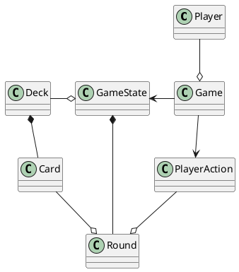

Simple card game
================

This is a simple single player card game. 
The human player plays against 3 AI opponents.
The goal is to get the score of 30 points or more first.

## Rules

The game is played with a standard 52 card deck.
Every round one card is drawn from the deck and the players bid on it.
The player with the highest bid pays the coins and gets the points equal to the value of the card.
At the end of the round the first player is changed.
At the beginning of every round (starting from the second round) the players get 1 coin.
The game ends when one of the players reaches 30 points or more.

All players start with 0 points and 10 coins.

### Bidding
Each round the players bid coins starting with the first player.
Every bid must be higher than the previous one.
The player with the highest bid gets the number of points equal to the value of the card.

### Passing
The player can skip the bid if he doesn't want to bid (or can't bid higher).
This is called "passing".

## Design

### Technologies
Project is created with:
* Kotlin Compose for Desktop
* Kotlin Coroutines

### Structure
PlantUML class diagram of the main components:

