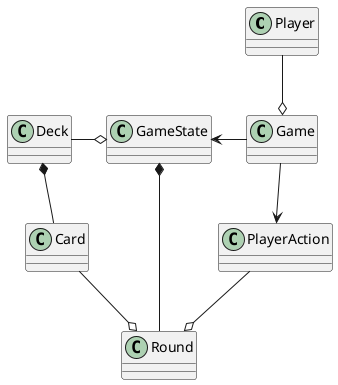
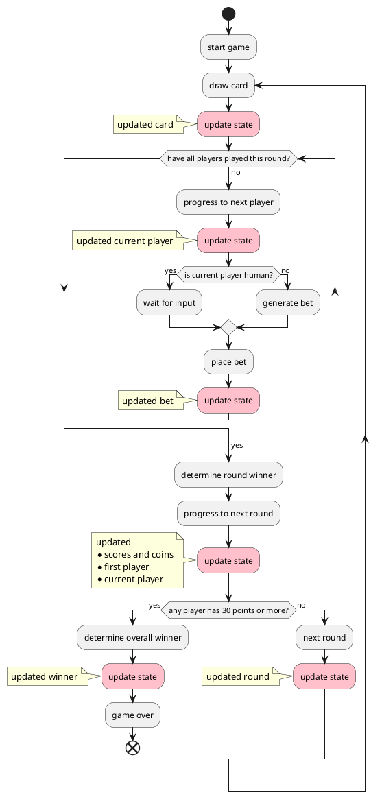

Simple card game
================

This is a simple single player card game. 
The human player plays against 3 AI opponents.
The goal is to get the score of 30 points or more first.

## Rules

The game is played with a standard 52 card deck.
Every round one card is drawn from the deck and the players bid on it.
The player with the highest bid pays the coins and gets the points equal to the value of the card.
At the end of the round the first player is changed.
At the beginning of every round (starting from the second round) the players get 1 coin.
The game ends when one of the players reaches 30 points or more.

All players start with 0 points and 10 coins.

### Bidding
Each round the players bid coins starting with the first player.
Every bid must be higher than the previous one.
The player with the highest bid gets the number of points equal to the value of the card.

### Passing
The player can skip the bid if he doesn't want to bid (or can't bid higher).
This is called "passing".

## Future features

* Settings screen (language, background music)
* Optimize for Windows
* Compile for mobile platforms
* Animations (screen transitions, UI element transformations)
* Very hard difficulty level (deep learning AI)
* Local multiplayer (hot seat)
* Global multiplayer 
  * Shared leaderboard
* New game modes (blind bidding, special powers)

## Design

### Technologies
Project is created with:
* Kotlin Compose for Desktop
* Kotlin Coroutines

### Structure
PlantUML class diagram of the main components:


### Flow diagram
PlantUML flow diagram of the game flow:


# How to build and run the game

## Add local properties

If it doesn't exist alredy, create `local.properties` file and set your Firebase project details

```properties
firebase.projectId=
firebase.apiKey=
firebase.appId=
firebase.storageBucket=
```

## Build

### Build a fat JAR

Build a fat JAR with Gradle
```
./gradlew :shadowJar
```

and run it with Java
```
java -jar build/libs/simple-card-game-[version]-all.jar
```

### Build a Windows executable

To build a Windows executable (.exe) file, run:
```
./gradlew buildWindowsExecutable
```

This will create:
1. A standalone Windows executable (.exe) file at `build/compose/binaries/main/exe/simple-card-game-[version].exe`
2. A Windows MSI installer package at `build/compose/binaries/main/msi/simple-card-game-[version].msi`

#### Using the standalone .exe file
The .exe file is a standalone executable that can be run directly on Windows without installation:
1. Copy the .exe file to a Windows system
2. Double-click the .exe file to run the application

#### Using the MSI installer
The MSI package provides a system-wide installation:
1. Copy the MSI file to a Windows system
2. Double-click the MSI file to install the application
3. After installation, you can run the application from the Start menu

Note: You can build the Windows executable from any platform (Windows, macOS, Linux), but the resulting executable will only run on Windows.
