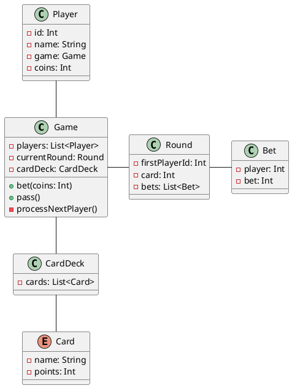

# Game design

## Domain entities

* Game
  * Round
* Card
  * 
* Player
  * Coins

```plantuml
@startuml

class Game {
    -players: List<Player>
    -currentRound: Round
    -cardDeck: CardDeck
    +bet(coins: Int)
    +pass()
    -processNextPlayer()
}
class Round {
    -firstPlayerId: Int
    -card: Int
    -bets: List<Bet>
}
class Bet {
    -player: Int
    -bet: Int
}
class Player {
    -id: Int
    -name: String
    -game: Game
    -coins: Int
}

class CardDeck {
    -cards: List<Card>
}
enum Card {
    -name: String
    -points: Int 
}

Player -- Game
Game - Round
Round - Bet
Game -- CardDeck
CardDeck -- Card

@enduml
```